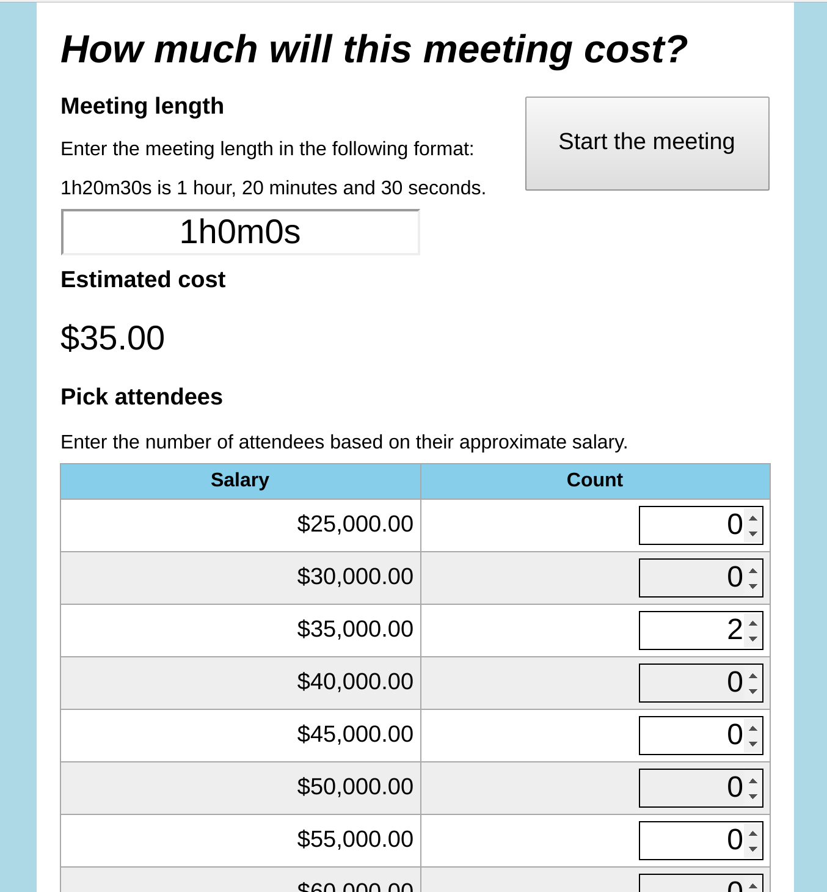
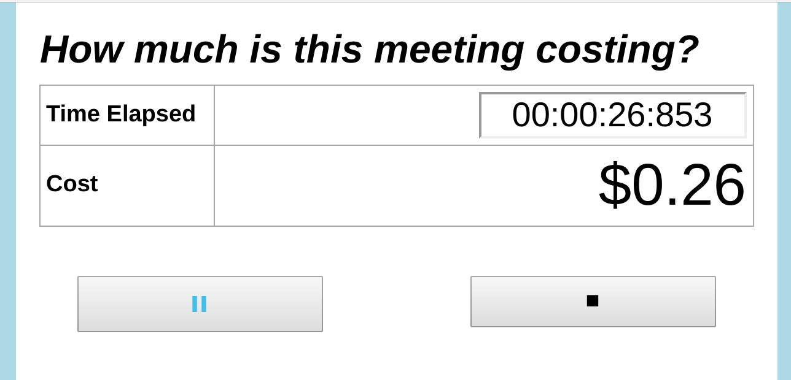

# Meeting Cost Clock
A clock that tells you how much a meeting is costing you, written in [Go](https://golang.org) and [Mithril](http://mithril.js.org) via [Moria](https://github.com/danverbraganza/go-mithril).

Try out the [meeting cost clock live](https://danverbraganza.com/tools/meeting-cost-clock) now!

## Do you have meeting-itis?

Are you tired of spending so much time in meetings? Does the sight of yet another meeting appearing on your calendar make you groan? Are your meetings invariably filled with too many people? And are you fed up with meetings constantly running over time?

Then this simple web app might just be the tool you need to passive-agressively remind everyone that money is time, and that time has a way of flying quickly.

You can begin a meeting by entering a duration, adding some attendees, and then hitting *Start the meeting*:
<figure>
<figcaption><label for="begin-image"><b>Fig 1: Beginning a meeting</b></label></figcaption> 
</img>
</figure>

This takes you to the following dramatic scene where everyone can see the time running out!
<figure>
<figcaption><label for="during-image"><b>Fig 2: A meeting in progress</b></label></figcaption> 
</img>
</figure>

What's more, once the meeting has run over time, the cost will turn an angry red, to let everyone 
know that precious time is being wasted.

> But doesn't something like this already exist?

Well, it's true. After I had the idea of making this, I found out that a number of tools 
built around estimating meeting costs already exist. So why did I decide to build another one myself?

The first reason is it's such a simple idea to reimplement that it hardly makes a difference that
something like this already exists. Just like Classical painters all drawing the Last Supper and leaving 
their individual mark on it, or frontend MVC framework designers building yet another Todo app.  

The second, and larger reason, is that I wanted a chance to use and showcase the Moria framework that 
I built as part of [go-mithril](https://github.com/danverbraganza/go-mithril). Using Moria, this 
Single-Page Web App was written entirely in Go, and compiled to Javascript using GopherJS. I think this way of building simple apps is pretty cool, and I encourage you to have a look around this repository to see how the components of this project are organized.

